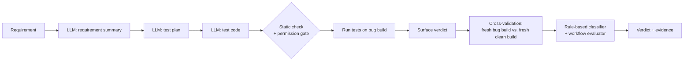

# QA Factory

[](https://github.com/chengnick/qa-factory/actions/workflows/ci.yml)

An LLM pipeline that reads a requirement, writes tests for it and runs them against a small web app with seeded bugs. The project is less about generating tests than about one question: **when the pipeline says "defect found", can you trust it, and when it fails, can you tell why?**

Every run leaves a trace and its evidence. Verdicts come from rules, not from model output. Results were measured on a held-out set of bugs after the prompt, model and conditions were frozen.

---

## Results

Phase 5 evaluation, `gemini-3.5-flash-lite`, temperature 0, prompt v3. 10 seeded bugs: 3 in a dev set (used for prompt tuning), 7 held out and run only after the freeze ([frozen.yaml](benchmark/frozen.yaml)). Each combination ran 5 rounds. Full record: [acceptance.md](benchmark/results/phase5/acceptance.md).

| | Result |
|---|---|
| Held-out detection, verified by cross-validation | **25/28** (89%, 95% CI 73–96%) |
| &nbsp;&nbsp;API requirements | 19/20 |
| &nbsp;&nbsp;UI requirement (REQ-004) | 6/8 |
| False "defect found" on the clean build, as a user would see it | **4/20** (20%, 95% CI 8–42%) |
| &nbsp;&nbsp;of which from the UI requirement | 3 of 4 |
| Same false positives after cross-validation | 0/20 |
| Failure attribution vs. manual labels | **24/28** (86%, 95% CI 69–94%) |
| Dev set detection | 9/9 |
| Runs blocked by provider outages (HTTP 503/504), reported, not re-run | 24/90 |

**What the numbers say.** The pipeline is reliable on API requirements. Its weak point is UI test generation: on the one UI requirement, half of the broken tests were plain code errors (`NameError` from using `page` without its fixture, `AttributeError` from JavaScript-style Playwright calls such as `toBeVisible`) and half came from a gap in the requirement itself, which also caused all three UI false positives ([breakdown](benchmark/results/phase5/analysis/req004_breakdown.md)). Cross-validation is what keeps a user from acting on those false alarms.

**Attribution.** When the classifier said "the system is at fault", the manual labels agreed in 18 of 18 cases. All 4 disagreements are one case: the UI requirement does not say what the page must do in certain situations, so "test is wrong" and "system is wrong" are both defensible ([score](benchmark/labels/phase5/score.md)). One labeller, the author; labels were committed before scoring (`9617645`).

---

## How it works



**The LLM proposes; code decides.** Each step in the pipeline is one of four kinds:

| Kind | Steps |
|---|---|
| **LLM** (produces content only) | Requirement summary, test plan, test code. Three calls per run. The model never chooses a tool. |
| **Code** (deterministic) | Handoff schema checks, test-plan size limit, static check of generated code, permission gate, tool argument checks, retry policy, SUT start and health check, cross-validation, failure classification, verdict, workflow rules, evidence storage and hashing, freeze check |
| **Tool** (executes) | `pytest`, Playwright, `http_request`, `file_write` |
| **Human** (in development, not at run time) | Writing requirements, seeded bugs and reference tests; freezing the evaluation; approving post-evaluation changes; manual attribution labels |

The verdict is never taken from model output. A scripted model that "obeys" an instruction to mark every test as passed does not change it ([agent_security tests](tests/agent_security/)).

---

## Design decisions

- **Cross-validation instead of trusting a failure.** Generated tests run once on a fresh buggy build and once on a fresh clean build. Only "fails on the bug, passes without it" counts as a detected bug. It confirms the failure depends on the bug, not that the test describes that bug; the manual labels check the second part.
- **Held-out bugs and a freeze.** The prompt was tuned on 3 bugs only. Prompt, model, temperature, lockfile, policy and test fixtures were hashed into `frozen.yaml` before the other 7 bugs were run; their contents did not change afterwards. The one frozen value that now differs is the lockfile hash, because its computation was changed to ignore line endings (amendment A8). Later changes are listed in [frozen_amendments.yaml](benchmark/frozen_amendments.yaml), which can only grow.
- **Rule-based attribution.** Each failure gets a layer (system under test, test, harness, agent, provider, environment) from an ordered rule table, with the matching rule and evidence recorded. No confidence scores; an unmatched failure is `UNKNOWN`, not guessed.
- **Fixed tool routing.** Agents call tools in code; the model only writes content. Fault-injection tests therefore exercise the safeguards (gate, registry, trace, classifier) with scripted agents, not the model's behaviour.
- **Policy is not isolation.** The [policy file](config/agent_policy.yaml) says what an agent may do; isolation decides what it actually can do. Current isolation is in-process (see *Limitations*).
- **Evidence is never deleted.** Every run keeps its trace, prompts, generated tests, logs and verdicts under `artifacts/{run_id}/`; evaluation runs are committed to `benchmark/results/`.

---

## Testing the safeguards

**Property-based tests** ([tests/property/](tests/property/), Hypothesis) check over generated inputs that a refused tool call never executes; that every spelling of a protected path is refused and judged the same; that URLs which only look like the app are refused; and that the verdict follows its priority order and is never PASS when no test ran.

- They found a **latent bug** in the generated-code check: `http://127.0.0.1:<port>@evil.test` and similar URLs were accepted as the app (prefix match without a boundary). No generated test in any recorded run contained a hard-coded URL, so no result changed. Fixed with approval and recorded as an amendment.
- Five deliberately injected bugs (via monkeypatch) were each caught.

**CI** runs on Ubuntu and Windows. It caught a second bug: the freeze check hashed the lockfile without normalising line endings. The frozen value had been computed on a local Windows checkout with CRLF line endings (`core.autocrlf`), so CI's LF checkouts, on Ubuntu and on Windows alike, disagreed with it (CI #21). The hash now normalises line endings; recorded as an amendment.

**Secrets** ([tests/property/test_prop_secrets.py](tests/property/test_prop_secrets.py), [test_secrets_e2e.py](tests/property/test_secrets_e2e.py)): synthetic secrets (FakeLLM only) are injected through environment variables, tool inputs and outputs, exception messages, HTTP headers and requirement text, and every file a run saves is scanned, including junit XML, pytest logs, Playwright console.log and the unzipped trace.zip. They found two leaks, both fixed with approval: a refused file write put the secret it had detected into `meta.json`, and agent output was redacted only after JSON escaping, which hid `"api_key": "…"` from the masking rules.

**Fault injection** ([tests/agent_faults/](tests/agent_faults/), [tests/agent_security/](tests/agent_security/)): 111 deterministic tests for provider outages, retry loops, tool misuse, permission violations and test weakening across revision rounds; identical results across 20 consecutive runs (re-checked 2026-10-06; 104 tests when first measured in Phase 3).

---

## Quick start

```bash
pip install -r requirements.lock
pip install --no-deps -e .

python app.py --requirement REQ-005 --llm fake   # scripted run, no API key needed
pytest -m "not live"                             # full test suite, offline
python -m benchmark.matrix                       # check every seeded bug against its reference test
```

A live run needs `GEMINI_API_KEY` in a git-ignored `.env`:

```bash
python app.py --requirement REQ-005 --llm gemini --sut-bugs B02
```

---

## Limitations

The most important ones; the full list is in [docs/limitations.md](docs/limitations.md).

- **Small benchmark.** One app, 9 requirements, 10 seeded bugs, 5 rounds per combination. Confidence intervals are wide.
- **One model.** All results use `gemini-3.5-flash-lite`, the model the prompt was tuned on. They cannot be reproduced once that model is retired. No other model was compared.
- **REQ-004 has a requirement gap.** It does not say which situations the page must show as errors. The benchmark is frozen, so the requirement was left as it is.
- **Isolation is in-process (L1a).** Generated tests run under a Python audit hook that limits file writes, network and processes. It is not an OS sandbox and has known gaps; OS-level isolation (L1b) is not done. Credential files in the user's home directory (such as `~/.ssh` or `~/.netrc`) are not protected: test code that gets past the static check can read them; tokens in environment variables never reach it.
- **Prompt-injection resistance of the model was not measured.** Tests show the safeguards hold when a scripted model obeys an injection; how often a real model would obey is untested.
- **"FLAKY" in Phase 5 means provider retries.** All five FLAKY runs were LLM calls that failed and succeeded on retry; no test-level instability was observed. The verdict does not yet tell the two apart.
- **Latency depends on the provider.** Runs took 31 s on 2026-09-25 and 122 s on 2026-09-28; the pipeline's own share was about 23–27 s both times ([timing](benchmark/results/phase5/analysis/timing_breakdown.md)).
- **Secret masking covers known shapes only.** The exact values of configured secrets and the formats in `redact.py` are covered; secrets of arbitrary format and text inside images (screenshots, trace frames) are not. Verbatim evidence (generated tests, junit XML, Playwright traces) is never masked: it is guaranteed free only of the narrower shapes the secret scan detects, so a short Bearer value or an `auth_token=` value written into a test stays there.
- **Manual labels have one labeller, the author,** and cover only failures the classifier had already attributed (precision, not misses).

---

## Repository map

| Path | Contents |
|---|---|
| `sut/` | TaskBoard app (FastAPI, SQLite, one HTML page) with switchable seeded bugs |
| `benchmark/` | Requirements, bug list, reference tests, frozen conditions, all evaluation results |
| `agents/`, `llm/`, `pipeline.py` | The five agents, LLM client and adapter, pipeline |
| `tools/` | `pytest`, Playwright, HTTP and file tools; static check; isolation guard |
| `classification/`, `evaluation/` | Rule table and verdicts; cross-validation, runner, metrics, workflow rules |
| `permissions/`, `security/`, `config/` | Permission gate, policy file, security events |
| `observability/` | OpenTelemetry tracing with a JSON exporter |
| `docs/` | [Specification](docs/spec.md), [development log](docs/development-log.md), [limitations](docs/limitations.md) |

The project was built in phases with a written spec, and each phase was accepted against recorded evidence. The [development log](docs/development-log.md) has the per-phase detail.

The project is feature-frozen.

How the project was developed with a coding agent, with the working rules and the cases behind them: [docs/how-this-was-built.md](docs/how-this-was-built.md).
